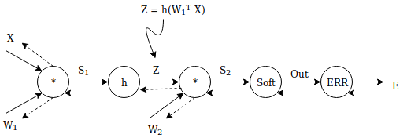

## How to calculate the gradients of our model
---

The cost function (logLikelihood plus reguralization term) we want to maximize:

 

  

The cost function can be simplified in the following form:

 

In the above formula we have used the fact that . The partial derrivatives of this function are given by the following  matrix:

where  is an  matrix with the truth values of the training data, such that ,  is the corresponding  matrix that holds the softmax probabilities such that  and  is the  matrix of the input data.

Our model:
 

We knows that:

and

So:

We want to find the derivative of E with respect to 

So:

Now we have to find the derivative of E with respect to 

So:

Now we have to find the derivative of E with respect to .

So:

From (1) and (4):

From (3) and (5):

And finally from (2) and (6):

To be more precise we calculated the folloing formula on the code in order to match the dimensions:

## Experiments
---

|DATASET |      AF        |  HU |  LR   | BS  | EP |  λ   |  PREC  |  FAULTS    |          LOSS       |
|--------|----------------|-----|-------|-----|----|------|--------|------------|---------------------|
|MNIST   |  log(1+exp(a)  | 100 | 0.01  | 100 | 20 | 0.01 | 96.0%  | 378/10000  | 0.02149685182986415 |
|MNIST   |  log(1+exp(a)  | 100 | 0.01  | 100 | 20 | 0.1  | 95.0%  | 540/10000  | 0.031112164568384643|
|MNIST   |  log(1+exp(a)  | 200 | 0.01  | 100 | 20 | 0.01 | 97.0%  | 345/10000  | 0.02010577089877303 |
|MNIST   |  log(1+exp(a)  | 200 | 0.01  | 100 | 20 | 0.1  | 96.0%  | 377/10000  | 0.02107684635067297 |
|MNIST   |  log(1+exp(a)  | 300 | 0.01  | 100 | 20 | 0.01 | 96.0%  | 383/10000  | 0.02087031117874914 |
|MNIST   |  log(1+exp(a)  | 300 | 0.01  | 100 | 20 | 0.1  | 95.0%  | 515/10000  | 0.027826618969941104|
|MNIST   |  log(1+exp(a)  | 100 | 0.001 | 100 | 20 | 0.01 | 97.0%  | 304/10000  | 0.016491149050940134|
|MNIST   |  log(1+exp(a)  | 100 | 0.001 | 100 | 20 | 0.1  | 96.0%  | 372/10000  | 0.022081386588496236|
|MNIST   |  log(1+exp(a)  | 200 | 0.001 | 100 | 20 | 0.01 | 97.0%  | 324/10000  | 0.017615595926705776|
|MNIST   |  log(1+exp(a)  | 200 | 0.001 | 100 | 20 | 0.1  | 96.0%  | 377/10000  | 0.02232538074135994 |
|MNIST   |  log(1+exp(a)  | 300 | 0.001 | 100 | 20 | 0.01 | 97.0%  | 308/10000  | 0.016828738665526016|
|MNIST   |  log(1+exp(a)  | 300 | 0.001 | 100 | 20 | 0.1  | 96.0%  | 379/10000  | 0.022502911867688623|
|MNIST   |  tanh(a)       | 100 | 0.01  | 100 | 20 | 0.01 | 97.0%  | 325/10000  | 0.01820067131758669 |
|MNIST   |  tanh(a)       | 100 | 0.01  | 100 | 20 | 0.1  | 97.0%  | 321/10000  | 0.01896547191812773 |
|MNIST   |  tanh(a)       | 200 | 0.01  | 100 | 20 | 0.01 | 97.0%  | 257/10000  | 0.013429537770700719|
|MNIST   |  tanh(a)       | 200 | 0.01  | 100 | 20 | 0.1  | 96.0%  | 400/10000  | 0.0232498281875079  |
|MNIST   |  tanh(a)       | 300 | 0.01  | 100 | 20 | 0.01 | 97.0%  | 267/10000  | 0.016775390518990345|
|MNIST   |  tanh(a)       | 300 | 0.01  | 100 | 20 | 0.1  | 97.0%  | 293/10000  | 0.016480225876886644|
|MNIST   |  tanh(a)       | 100 | 0.001 | 100 | 20 | 0.01 | 97.0%  | 272/10000  | 0.014720182423101883|
|MNIST   |  tanh(a)       | 100 | 0.001 | 100 | 20 | 0.1  | 97.0%  | 316/10000  | 0.019313561936769204|
|MNIST   |  tanh(a)       | 200 | 0.001 | 100 | 20 | 0.01 | 98.0%  | 244/10000  | 0.01359806941339456 |
|MNIST   |  tanh(a)       | 200 | 0.001 | 100 | 20 | 0.1  | 97.0%  | 303/10000  | 0.01840430378396086 |
|MNIST   |  tanh(a)       | 300 | 0.001 | 100 | 20 | 0.01 | 97.0%  | 256/10000  | 0.014234313437799928|
|MNIST   |  tanh(a)       | 300 | 0.001 | 100 | 20 | 0.1  | 97.0%  | 314/10000  | 0.018889408149553737|
|MNIST   |  cos(a)        | 100 | 0.01  | 100 | 20 | 0.01 | 98.0%  | 205/10000  | 0.011340870757118603|
|MNIST   |  cos(a)        | 100 | 0.01  | 100 | 20 | 0.1  | 62.0%  | 3757/10000 | 0.22384539759551028 |
|MNIST   |  cos(a)        | 200 | 0.01  | 100 | 20 | 0.01 | 47.0%  | 5345/10000 | 0.29445392721857533 |
|MNIST   |  cos(a)        | 200 | 0.01  | 100 | 20 | 0.1  | 97.0%  | 298/10000  | 0.015434613635408113|
|MNIST   |  cos(a)        | 300 | 0.01  | 100 | 20 | 0.01 | 98.0%  | 214/10000  | 0.011855030973231167|
|MNIST   |  cos(a)        | 300 | 0.01  | 100 | 20 | 0.1  | 97.0%  | 302/10000  | 0.01646245666537611 |
|MNIST   |  cos(a)        | 100 | 0.001 | 100 | 20 | 0.01 | 97.0%  | 253/10000  | 0.013644357232055943|
|MNIST   |  cos(a)        | 100 | 0.001 | 100 | 20 | 0.1  | 97.0%  | 263/10000  | 0.014520447048403612|
|MNIST   |  cos(a)        | 200 | 0.001 | 100 | 20 | 0.01 | 98.0%  | 223/10000  | 0.012138622641523043|
|MNIST   |  cos(a)        | 200 | 0.001 | 100 | 20 | 0.1  | 98.0%  | 242/10000  | 0.01396964505543445 |
|MNIST   |  cos(a)        | 300 | 0.001 | 100 | 20 | 0.01 | 98.0%  | 230/10000  | 0.011972733362605993|
|MNIST   |  cos(a)        | 300 | 0.001 | 100 | 20 | 0.1  | 98.0%  | 245/10000  | 0.014245294784819378|
|CIFAR 10|  log(1+exp(a)  | 100 | 0.01  | 100 | 20 | 0.01 | 10.0%  | 9000/10000 | 2.3038683811798712  |
|CIFAR 10|  log(1+exp(a)  | 100 | 0.01  | 100 | 20 | 0.1  | 10.0%  | 9002/10000 | 2.3229845684909867  |
|CIFAR 10|  log(1+exp(a)  | 200 | 0.01  | 100 | 20 | 0.01 | 10.0%  | 8998/10000 | 2.3553855345876533  |
|CIFAR 10|  log(1+exp(a)  | 200 | 0.01  | 100 | 20 | 0.1  | 10.0%  | 8986/10000 | 2.32908707129719    |
|CIFAR 10|  log(1+exp(a)  | 300 | 0.01  | 100 | 20 | 0.01 | 10.0%  | 8995/10000 | 2.306149856926362   |
|CIFAR 10|  log(1+exp(a)  | 300 | 0.01  | 100 | 20 | 0.1  | 10.0%  | 8995/10000 | 2.443158912198355   |
|CIFAR 10|  log(1+exp(a)  | 100 | 0.001 | 100 | 20 | 0.01 | 37.0%  | 6326/10000 | 1.7422330696635082  |
|CIFAR 10|  log(1+exp(a)  | 100 | 0.001 | 100 | 20 | 0.1  | 32.0%  | 6762/10000 | 1.9955945223591574  |
|CIFAR 10|  log(1+exp(a)  | 200 | 0.001 | 100 | 20 | 0.01 | 40.0%  | 5985/10000 | 1.7438636868219215  |
|CIFAR 10|  log(1+exp(a)  | 200 | 0.001 | 100 | 20 | 0.1  | 41.0%  | 5885/10000 | 1.6988855041373896  |
|CIFAR 10|  log(1+exp(a)  | 300 | 0.001 | 100 | 20 | 0.01 | 42.0%  | 5760/10000 | 1.7047928168191058  |
|CIFAR 10|  log(1+exp(a)  | 300 | 0.001 | 100 | 20 | 0.1  | 40.0%  | 5957/10000 | 1.7657227543528236  |
|CIFAR 10|  tanh(a)       | 100 | 0.01  | 100 | 20 | 0.01 | 18.0%  | 8160/10000 | 2.181416685391237   |
|CIFAR 10|  tanh(a)       | 100 | 0.01  | 100 | 20 | 0.1  | 17.0%  | 8313/10000 | 2.193307796701587   |
|CIFAR 10|  tanh(a)       | 200 | 0.01  | 100 | 20 | 0.01 | 21.0%  | 7948/10000 | 2.131880048498961   |
|CIFAR 10|  tanh(a)       | 200 | 0.01  | 100 | 20 | 0.1  | 17.0%  | 8260/10000 | 2.1556289660404984  |
|CIFAR 10|  tanh(a)       | 300 | 0.01  | 100 | 20 | 0.01 | 17.0%  | 8289/10000 | 2.1849639153444693  |
|CIFAR 10|  tanh(a)       | 300 | 0.01  | 100 | 20 | 0.1  | 18.0%  | 8180/10000 | 2.1605514304543436  |
|CIFAR 10|  tanh(a)       | 100 | 0.001 | 100 | 20 | 0.01 | 32.0%  | 6754/10000 | 1.8987871847431514  |
|CIFAR 10|  tanh(a)       | 100 | 0.001 | 100 | 20 | 0.1  | 32.0%  | 6756/10000 | 1.8981105661865498  |
|CIFAR 10|  tanh(a)       | 200 | 0.001 | 100 | 20 | 0.01 | 35.0%  | 6464/10000 | 1.854078276512081   |
|CIFAR 10|  tanh(a)       | 200 | 0.001 | 100 | 20 | 0.1  | 33.0%  | 6653/10000 | 1.8829083453455384  |
|CIFAR 10|  tanh(a)       | 300 | 0.001 | 100 | 20 | 0.01 | 35.0%  | 6549/10000 | 1.8543519119618401  |
|CIFAR 10|  tanh(a)       | 300 | 0.001 | 100 | 20 | 0.1  | 35.0%  | 6451/10000 | 1.844935124576075   |
|CIFAR 10|  cos(a)        | 100 | 0.01  | 100 | 20 | 0.01 | 10.0%  | 8960/10000 | 2.3039603145835903  |
|CIFAR 10|  cos(a)        | 100 | 0.01  | 100 | 20 | 0.1  | 10.0%  | 8988/10000 | 2.309775191952948   |
|CIFAR 10|  cos(a)        | 200 | 0.01  | 100 | 20 | 0.01 | 10.0%  | 9033/10000 | 2.3069022195503783  |
|CIFAR 10|  cos(a)        | 200 | 0.01  | 100 | 20 | 0.1  | 10.0%  | 9032/10000 | 2.317701944842611   |
|CIFAR 10|  cos(a)        | 300 | 0.01  | 100 | 20 | 0.01 | 10.0%  | 9029/10000 | 2.3095460349692725  |
|CIFAR 10|  cos(a)        | 300 | 0.01  | 100 | 20 | 0.1  | 10.0%  | 9027/10000 | 2.32414912780646    ||
|CIFAR 10|  cos(a)        | 100 | 0.001 | 100 | 20 | 0.01 | 10.0%  | 9030/10000 | 2.3029724487331773  |
|CIFAR 10|  cos(a)        | 100 | 0.001 | 100 | 20 | 0.1  | 10.0%  | 9031/10000 | 2.3037930272517815  |
|CIFAR 10|  cos(a)        | 200 | 0.001 | 100 | 20 | 0.01 | 10.0%  | 9014/10000 | 2.303085848678615   |
|CIFAR 10|  cos(a)        | 200 | 0.001 | 100 | 20 | 0.1  | 10.0%  | 8957/10000 | 2.304321870843905   |
|CIFAR 10|  cos(a)        | 300 | 0.001 | 100 | 20 | 0.01 | 10.0%  | 8964/10000 | 2.3033489294669782  |
|CIFAR 10|  cos(a)        | 300 | 0.001 | 100 | 20 | 0.1  | 10.0%  | 9000/10000 | 2.3056789012113845  |

## Gradient Check on CIFAR 10
---
w1_gradient shape: (200, 3073)  
w2_gradient shape: (10, 201)  
The difference estimate for gradient of w1 is :  3.597993445936254e-05  
The difference estimate for gradient of w2 is :  1.9889030319561463e-07  
Completed on 3h 30m approximately

